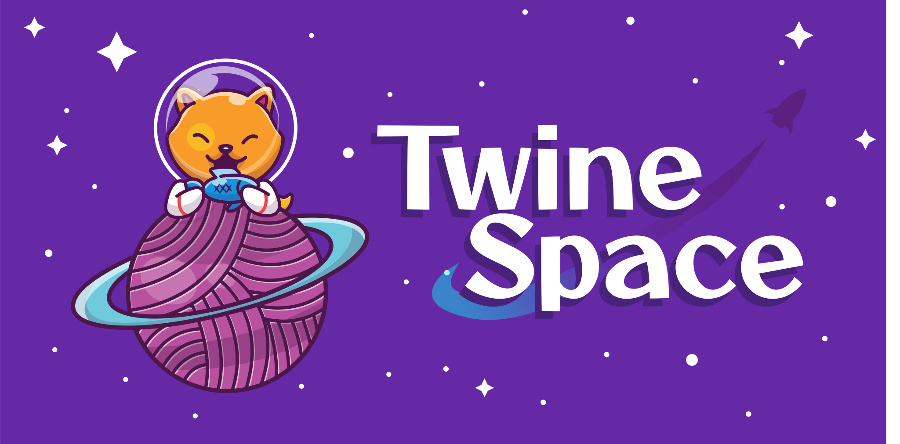

# TwineSpace

**TwineSpace** is a Twine 2 story format supporting mixed reality projects. It comes in two forms: AFrame (3D models and shapes) and AFrame + AR.js (3D shapes and models with support for location- and marker-based detection).

## Documentation

**TwineSpace** has [online documentation](https://videlais.github.io/twine-space/#/).

## Loading TwineSpace

1. Open Twine 2.
2. Go to "Twine"
3. Click on "Story Formats"
4. Click on "+Add"
5. In the prompt, enter the the variant wanted
   1. AFrame (3D shapes and models): `https://videlais.github.io/twine-space/dist/aframe-format.js`
   2. AR.js (3D shapes and models with support for AR projects): `https://videlais.github.io/twine-space/dist/arjs-format.js`
6. Click on "+Add" to confirm.
7. Before testing or building a story, check Story -> Details and make sure "TwineSpace" is selected for the story format.

## Citation

