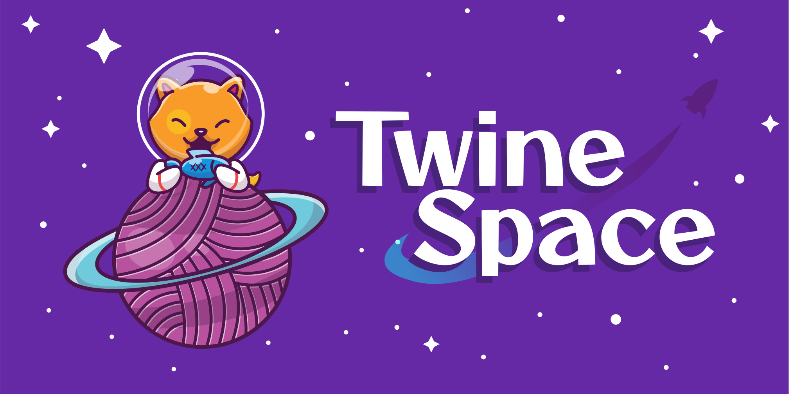

# TwineSpace

**TwineSpace** is a Twine 2 story format supporting 3D models and mixed reality projects.

## Citation

## Loading TwineSpace

1. Open Twine 2.
2. Go to "Twine"
3. Click on "Story Formats"
4. Click on "+Add"
5. In the prompt, enter the the variant wanted
   1. Aframe: `https://videlais.github.io/twine-space/dist/aframe-format.js`
   2. AR.js: `https://videlais.github.io/twine-space/dist/arjs-format.js`
6. Click on "+Add" to confirm.
