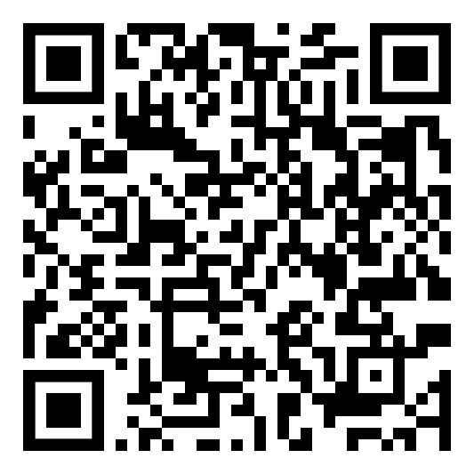
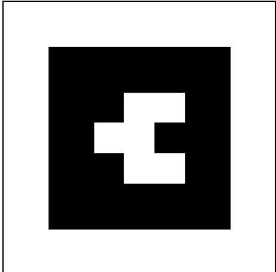

# Augmented (Barcode)

Barcode markers allow for creating projection-based projects by presenting "barcodes" to AR.js for scanning and visual augmentation.

Each barcode has a specific value associated with its visual appearance. The value is encoded in the use of colors (black on white or white on black) within a square shape.

When using the `(marker:)` macro in Twine Space, setting the `type` to `"barcode"` and supplying its `value` allows AR.js to detect and react.

## Example

```twee
(marker: type="barcode" value="2")[
    (text: color="yellow" position="0 0 0" value="Augmented text!")
]
```

In the above code, detection of a 3x3 barcode with the value `2` will prompt AR.js to add text in the color `yellow` with the `value` of `"Augmented text!"`.

## Live Version

[Link to HTML](https://videlais.github.io/twine-space/examples/ar/augmented-barcode.html)

## Load via QR Code



Barcode of value 2 marker:


