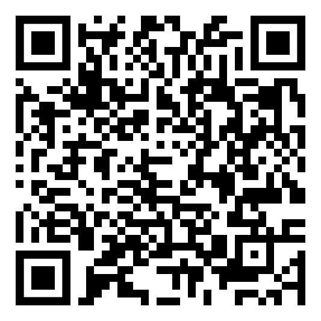

# Augmented (Hiro)

Hiro markers allow for creating projection-based projects by presenting the word "hiro" surrounded by a border to AR.js for scanning and visual augmentation.

AR.js comes with an understanding of hiro markers as a present. When using the `(marker:)` macro in TwineSpace, setting the present to `"hiro"` tells it to expect a hiro marker.

## Example

```twee
Show me a hiro marker!

(marker: preset="hiro")[
    (box: position='0 0 0' color="red")
]
```

In the above code, detection of a hiro marker will prompt AR.js to add a red box where it detects the marker.

## Live Version

[Link to HTML](https://videlais.github.io/twine-space/examples/ar/augmented-hiro.html)

## Load via QR Code



Hiro marker:


